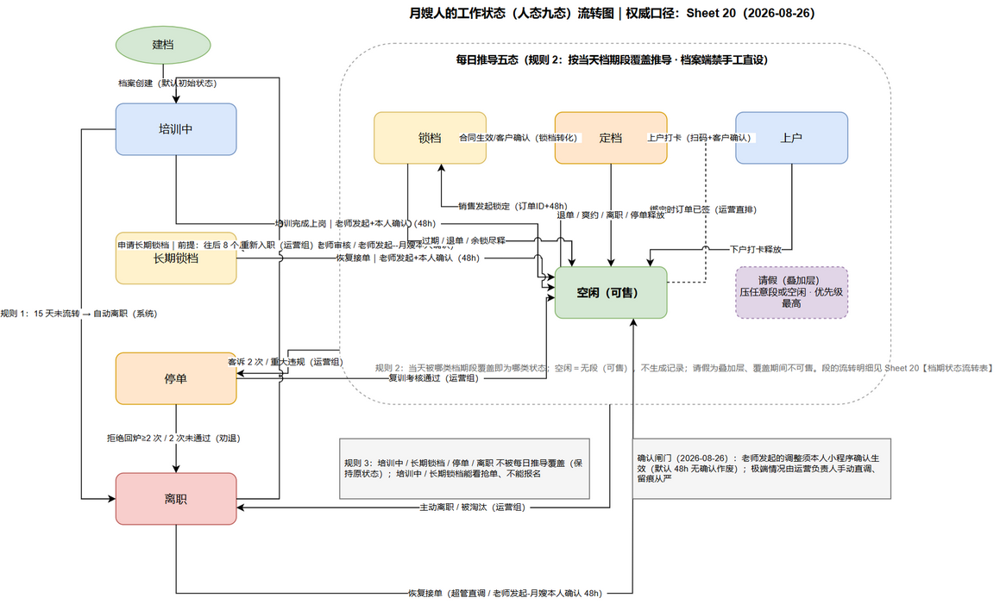

# 附图 · 人态工作状态流转图

> 月嫂人的工作状态（人态九态）流转的图形化。权威口径：《月嫂运营/月嫂信息全维度记录.md》Sheet 20【人的工作状态流转表】；配套说明与维护规则：《月嫂运营/流程图/人态工作状态流转图.md》。

## 三区速读

| 区域 | 内容 | 关键规则 |
|---|---|---|
| 左列（手工特殊态） | 培训中 / 长期锁档 / 停单 / 离职 | 白名单进出；老师发起须本人小程序确认（48h 无确认作废），极端情况运营负责人直调 |
| 右侧虚线容器（推导五态） | 空闲 / 锁档 / 定档 / 上户 / 请假（叠加层） | 规则 2：按当天档期段覆盖自动推导，档案端禁手工直设 |
| 灰框注释 | 规则 3 + 确认闸门 | 四态不被推导覆盖；确认闸门 48h |

**虚线边**：绑定时订单已签合同 → 运营直排直接定档（三方合同签约即知情，无需月嫂确认）。
