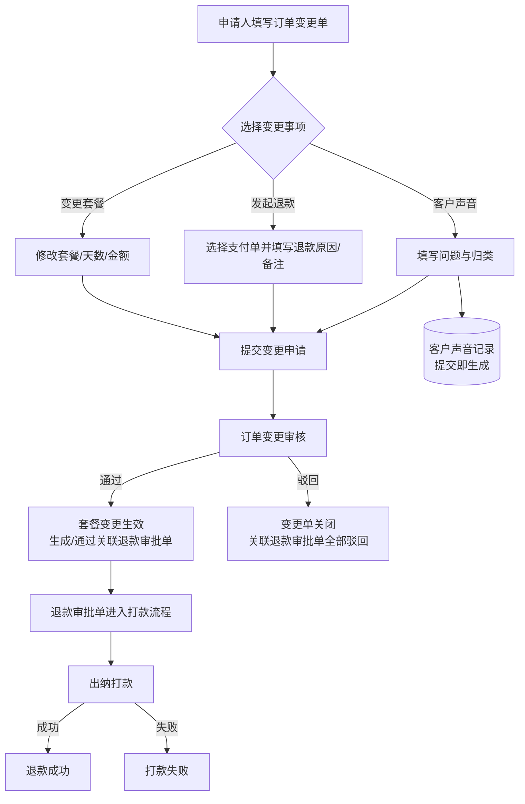
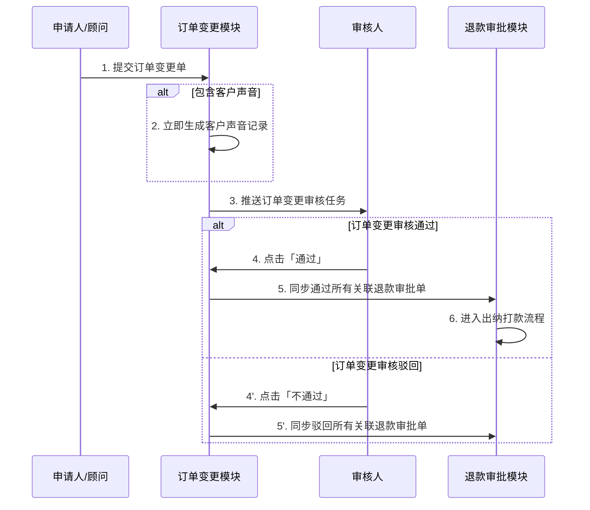

# 订单变更优化-需求文档
---

## 1. 项目背景与目标

### 1.1 背景

#### 1.1.1 业务现状
在月子服务业务中，订单签订后因客户需求变化、服务调整或信息录入错误等原因，经常需要对原订单进行变更。一个完整的订单变更往往同时包含以下几类内容：
- **服务信息变更**：套餐升级/降级、服务天数增减、服务地址变更、节假日费用调整等；
- **资金变更**：部分或全部退款、补差价、多笔支付单分批退款；
- **客诉记录**：客户声音、问题归类、责任部门划分等。

目前，这些变更的申请入口、审核入口、退款审批入口分散在不同功能模块中，数据未打通，审核人需要在多个页面之间切换，才能还原一笔订单变更的完整上下文。

#### 1.1.2 当前痛点
1. **信息割裂，审核效率低**：原后台订单审核界面仅展示「套餐变更」信息，退款审批单、客户声音、退款原因、退款备注等关键信息需要到其他模块查看，审核人无法在同一界面完成判断。
2. **变更与退款关系不透明**：同一笔订单变更可能关联多笔退款支付单，但审核人难以直观看到「这笔订单变更通过了，对应的哪些退款单会一起通过；驳回了，哪些退款单会一起驳回」。

#### 1.1.3 改版必要性
随着业务量增长和退款场景增多，原有「套餐变更与退款分离」的处理方式已无法满足运营、财务、客服等多角色协同审核的需求。需要建设一个覆盖「申请 → 审核 → 退款联动 → 结果反馈」的完整订单变更管理体系，以提升审核效率、降低操作风险、改善客户体验。

### 1.2 目标
1. **统一申请入口**：在顾问/前台端提供统一的订单变更申请表单，支持套餐变更、发起退款、客户声音三类事项自由组合，变更原因不再强制联动变更事项。
2. **统一审核视图**：在后台审核界面完整展示订单信息、变更详情、关联退款明细与汇总、审核记录，让审核人无需跳转即可掌握全部信息。
3. **建立联动规则**：明确「订单变更审核单」与「退款审批单」的联动关系——订单变更通过则关联退款全部通过，订单变更驳回则关联退款全部驳回。
4. **强化规则提示**：在审核弹窗等关键操作位置显著提示联动规则，避免审核人因信息不足而误操作。

---

## 2. 术语定义

| 术语 | 说明 |
|------|------|
| 订单变更单 | 客户/顾问提交的、对原订单服务内容及金额进行调整的申请单。 |
| 退款审批单 | 针对一笔或多笔支付单发起的退款流程单，需经过多级审批。 |
| 客户声音 | 客户问题/投诉记录，提交即生成，不等待订单变更审批。 |
| 变更事项 | 订单变更单内可启用的子模块：变更套餐、发起退款、客户声音。 |
| 关联退款 | 某笔订单变更单下对应的所有退款审批单集合。 |
| 补偿天数 | 订单级字段，因补偿赠送给客户的额外服务天数，默认 0；仅能通过订单变更赋值。 |
| 补偿金额 | 订单级字段，因补偿给予客户的金额，默认 0；仅能通过订单变更赋值，不参与总服务金额计算。 |

---

## 3. 核心业务流程

### 3.1 整体流程

### 3.2 订单变更与退款审批联动时序

---

## 4. 业务规则

### 4.1 订单变更申请规则
1. **变更原因必填**：从预设原因中选择，不再自动联动变更事项。
2. **至少启用一项变更事项**：变更套餐、发起退款、客户声音可单选或多选。
3. **发起退款规则**：
   - 只能选择「可退金额 > 0」且未在退款审批中的支付单；
   - 本次退款金额必须大于 0 且不超过可退金额；
   - 退款原因、退款备注均必填。
4. **变更套餐规则**：服务天数、服务地址、合同服务金额、节假日费用必填；总服务金额自动计算。
5. **补偿字段规则**：补偿天数、补偿金额为订单级字段，**仅能通过订单变更赋值**（订单其他入口不可修改）；默认 0，不得为负数，无补偿时保持 0；补偿金额不参与总服务金额计算。
6. **客户声音规则**：发生时间、对应月嫂、问题来源、问题详情、一类归类必填；提交即生成，不等待订单变更审批。
7. **公共必填**：变更开始时间、变更备注。

### 4.2 审核联动规则（重点）
- **订单变更审核通过** → 该订单变更单关联的所有退款审批单状态同步为「审核通过」。
- **订单变更审核驳回** → 该订单变更单关联的所有退款审批单状态同步为「已驳回」。
- 审核弹窗必须在显著位置提示该规则。

---

## 5. 原型文件清单

| 文件 | 用途 | 主要页面 |
|------|------|----------|
| `订单变更-发起原型.html` | 前台/顾问端申请页 | 订单变更申请表单 |
| `订单变更-审核原型.html` | 后台审核列表/详情 | 审核列表、订单信息、变更详情、关联退款、审核记录 |
| `订单变更-审核弹窗原型.html` | 后台审核操作弹窗 | 审核弹窗 + 联动规则提示 |
